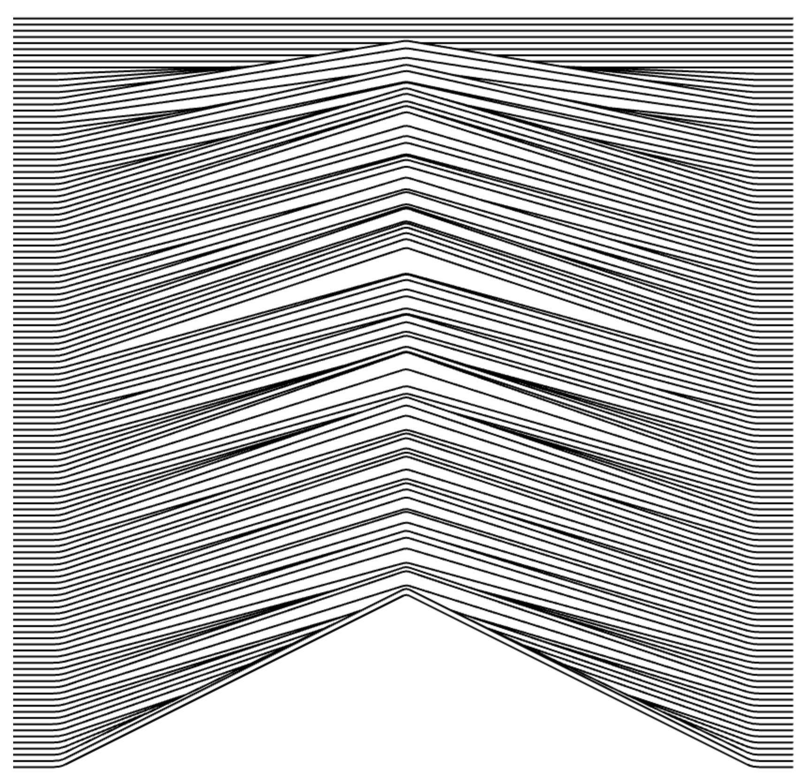

# WebAudio API Visualizer

The actual song cannot be pushed for obvious reasons (copyright!! <3) (song must be put into a /public folder)

Stick your own in and check it out. Example image below.

As a default, the 44.1kHz sample is split into 128 evenly cut up frequency ranges, one line for each range (bottom-most line for the lowest bass frequencies).

The lines are reactive to the audio at a default refresh rate of 10hz.

:)